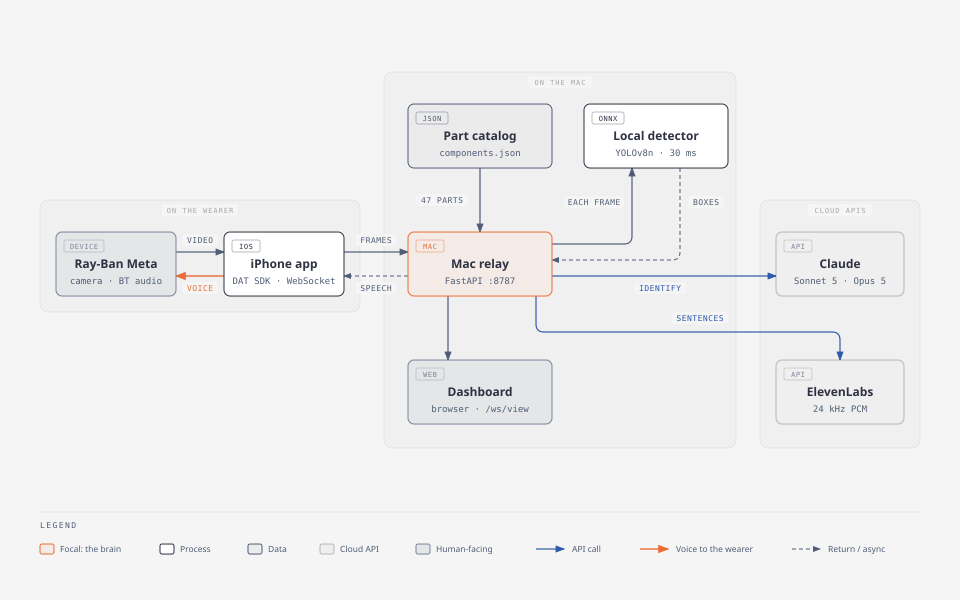

# Glasses Inspector

Hands-free part identification for Ray-Ban Meta glasses, built at DNHacks 2026 (Energy &
Industrialization track). The wearer looks at an electronic component; the glasses say its
name within about two seconds and answer spoken questions about it ("inspector, which wire is
the signal?"), and a dashboard on the Mac shows what the system saw and heard.



## What runs today

- `clients/ios/GlassesInspector`: iPhone app (fork of Meta's DAT `CameraAccess` sample). It
  streams the glasses camera to the Mac over a WebSocket, transcribes the wearer's questions
  from the glasses mic on the phone, and plays the Mac's speech into the glasses.
- `services/relay_receiver`: the Mac relay. A local YOLOv8 detector on every frame, Claude
  identification against the part catalog, ElevenLabs voice, and a live dashboard on `:8787`.
  Setup, endpoints, and tuning live in
  [`services/relay_receiver/README.md`](services/relay_receiver/README.md).
- `docs/components`: the researched part catalog (`components.json`, 47 parts) the relay loads
  at startup, plus query and merge scripts and a small retrieval eval.
- `docs/meta-glasses-field-notes.md`: hardware facts, measurements, and root causes of past
  outages. `docs/TEAM_PLAN.md`: the three tracks and the phone<->Mac interface contract.

Quick start on the Mac (put `ANTHROPIC_API_KEY` in `services/relay_receiver/.env`, or use
`INSPECT_FAKE=1` for canned answers):

```bash
services/relay_receiver/run.sh
```

Then run the iOS app from Xcode, pick the receiver from the Bonjour list in the gear menu, and
press Preview.

Everything below documents `services/vision_api`, the earlier server-side scaffold that the
phone app does not use yet.

## Ray-Ban Meta live vision scaffold (`services/vision_api`)

This service starts the server side of a hands-free industrial/field-vision
prototype: receive a wearer’s point-of-view frames, keep latency bounded, run a
segmentation model, and return structured regions to a mobile client.

The [Meta Wearables Device Access Toolkit](https://developers.meta.com/blog/introducing-meta-wearables-device-access-toolkit/)
gives preview developers access to glasses camera and audio functionality through
their mobile apps. This project does **not** assume a private transport or API
shape from Meta. Instead, it defines the server boundary immediately after the
native companion app has obtained and decoded a camera frame.

## Pipeline

```text
Meta glasses camera
      │  Device Access Toolkit / native iOS or Android companion app
      ▼
Video transport adapter (WebRTC/H.264, when SDK details are available)
      │  timestamped JPEG, PNG, or WebP frames
      ▼
FastAPI ingest service ──► bounded latest-frame queue ──► vision engine
      │                                                        │
      └──────── ACK / metrics ◄──── structured masks ◄─────────┘
```

The current service receives **decoded image frames**, not a raw video codec.
That isolates vision and segmentation from the eventual glasses transport. A
mobile bridge can initially sample video at 4–10 FPS, encode a JPEG/WebP frame,
and send it over the WebSocket. A later WebRTC/H.264 adapter simply needs to
emit the same `FrameMetadata + bytes` pair.

## Modular workflows

The service is worker-agnostic. A stream session selects a versioned workflow;
the selected package supplies the VLM context and is included in every result.
Worker roles are therefore configuration, not code branches.

Workflow definitions are JSON files in `services/vision_api/workflow_definitions/`.
Each contains an id, version, instructions, and observable checkpoints:

```json
{
  "id": "asset-inspection",
  "version": "1.0.0",
  "title": "Asset inspection",
  "instructions": "Report evidence and uncertainty; do not authorize work.",
  "checkpoints": [
    {"id": "identify-asset", "title": "Identify asset", "evidence_prompt": "Read visible labels."}
  ]
}
```

`GET /v1/workflows` lists the available packages. Select one while creating a
session; omitting it uses `generic-field-support`:

```bash
curl -X POST http://localhost:8000/v1/sessions \
  -H 'content-type: application/json' \
  -d '{"workflow_id":"asset-inspection"}'
```

Set `WORKFLOW_DEFINITIONS_DIR` to a directory of replacement JSON definitions
to deploy a different customer, job, or procedure set without changing Python.
The workflow shapes model context but never turns the model into an authority to
clear hazardous work or execute a physical action.

## Advisory external signals

An Arduino or other companion device can record a non-contact field observation:

```bash
curl -X POST http://localhost:8000/v1/sessions/SESSION_ID/advisory-field-signals \
  -H 'content-type: application/json' \
  -d '{"level":8.5,"state":"field_detected"}'
```

This signal is deliberately named *advisory*: it can drive a warning or enrich
the session log, but it cannot pass an isolation step or establish that equipment
is deenergized. A visual lock/tag, VLM result, and non-contact sensor all remain
observations. OSHA requires a qualified person to use test equipment before
electrical equipment can be considered deenergized; its guidance also says an LED
indicator alone is insufficient for isolation verification. See
[29 CFR 1910.333](https://www.osha.gov/laws-regs/regulations/standardnumber/1910/1910.333)
and [OSHA's LED interpretation](https://www.osha.gov/laws-regs/standardinterpretations/2012-12-12).

## What is implemented

- `POST /v1/sessions` creates a short-lived stream session.
- `GET /v1/workflows` exposes versioned workflow packages.
- `WS /v1/sessions/{session_id}/frames` accepts alternating metadata JSON and
  binary image messages.
- `POST /v1/sessions/{session_id}/frames` is an HTTP fallback for native bridges.
- A bounded queue drops old frames under load, keeping live guidance fresh.
- The engine interface supports segmentation-only models and VLM/VLA reasoning.
- The default deterministic mock backend exercises the contract without a GPU.
- Result and metrics endpoints expose regions, observations, action proposals,
  latency, and dropped-frame counts.

## Run locally

```bash
cp .env.example .env
python3 -m venv .venv
.venv/bin/pip install fastapi httpx pydantic-settings 'uvicorn[standard]' pytest pytest-asyncio
PYTHONPATH=services .venv/bin/uvicorn vision_api.main:app --reload
```

(`pip install -e '.[dev]'` currently fails: setuptools sees both `clients/` and `services/`
at the repo root and refuses flat-layout auto-discovery. Installing the dependencies directly,
as above, is the workaround.)

Create a session:

```bash
curl -X POST http://localhost:8000/v1/sessions
```

Then open a WebSocket to the returned session’s `/frames` URL. Send one
`FrameMetadata` JSON message, then the matching JPEG/PNG/WebP bytes. The server
responds with an acknowledgement; read `/results` for segmentation output.

Run the tests (either runner works; pyproject sets `pythonpath = ["services"]`):

```bash
PYTHONPATH=services .venv/bin/python -m unittest discover -s tests -v
.venv/bin/pytest
```

Docker is also available after creating `.env`:

```bash
docker compose up --build
```

## Bring your VLM/VLA

Set these values in `.env` to use a vision-capable model exposed through an
OpenAI-compatible `/v1/chat/completions` endpoint:

```bash
VISION_BACKEND=openai_compatible
VLM_BASE_URL=https://your-model-host/v1
VLM_API_KEY=your-secret
VLM_MODEL=your-vision-model
```

Each submitted image is sent as a base64 image message. The model must respond
with JSON matching `VisionOutput`: `regions` plus optional `analysis` containing
observations, safety alerts, and `proposed_actions`. A model can therefore act as
a VLM (describe/inspect the frame) or as a VLA planner (propose a next action).
The service never executes actions; every proposal is marked as requiring human
confirmation so the mobile client can keep a human in the loop.

To support another provider or an on-device runtime, implement the
`VisionEngine.analyze(frame) -> VisionOutput` contract and register it in
`build_vision_engine`.

## Component knowledge grounding

`docs/components/components.json` contains the researched ELEGOO kit records.
The `component_knowledge` backend turns a glasses frame into a grounded response:

```text
frame + optional user question → VLM scene description → component retrieval
→ selected records + frame → identification, checks, and clarifying questions
```

It intentionally sends only the best three records to the model, not the full
knowledge base. The server attaches the retrieved record IDs and their
high/medium/low data confidence to every result, and discards any model
identification that names an ID outside that candidate set.

Enable it with an OpenAI-compatible vision endpoint:

```bash
VISION_BACKEND=component_knowledge
VLM_BASE_URL=https://your-model-host/v1
VLM_API_KEY=your-secret
VLM_MODEL=your-vision-model
COMPONENT_KNOWLEDGE_TOP_K=3
```

The frame metadata can include an optional `user_request`, for example “Which
pin is ground?” or “Does this look wired correctly?” The result’s
`analysis.component_guidance` returns visible evidence, retrieved candidates,
identifications, apparent wiring discrepancies, and questions needed to reduce
uncertainty. A camera image cannot prove electrical continuity, correct wiring,
or safety; the backend is intentionally limited to observations and
human-confirmed checks.

The companion app can also query the records directly:

```bash
curl 'http://localhost:8000/v1/components/search?q=ultrasonic+sensor'
curl http://localhost:8000/v1/components/hc-sr04
```

## Arduino context node

[`firmware/context_node/context_node.ino`](firmware/context_node/context_node.ino)
uses only the Arduino core and the starter-kit parts. The current sketch reads a
capacitive touch/proximity antenna on A0 (two PN2222s as a Darlington amplifier; circuit,
readings, and the current upload blocker are in
[`TOUCH_SENSOR_DEMO.md`](firmware/context_node/TOUCH_SENSOR_DEMO.md)) and prints one JSON
observation every 500 ms at 115200 baud. The tilt switch (D3), buzzer (D8), and HC-SR04
(D9/D10) pins are still declared, but their JSON fields are fixed at `false` / `-1` while the
antenna is being characterised. It is a context signal only, never a voltage sensor.

To use it in VS Code, install the **PlatformIO IDE** extension, then open
`firmware/context_node` as the folder. Select the `uno` environment, use
**Build**, then **Upload**, and open the PlatformIO serial monitor at 115200.
The included `platformio.ini` supplies the Uno configuration. The threshold at
the top of the sketch should be calibrated from the actual antenna readings (idle near
1023, touch samples below about 850).

From a terminal, the equivalent commands are:

```bash
cd firmware/context_node
pio run
pio run --target upload --upload-port /dev/cu.usbmodemXXXX
pio device monitor --port /dev/cu.usbmodemXXXX --baud 115200
```

## First integration steps

1. **Mobile transport adapter:** In the iOS/Android app, request the applicable
   camera permission and obtain frames through the Device Access Toolkit. For the
   first demo, downscale to a fixed working size (for example 640px wide), sample
   at 4–10 FPS, attach capture timestamps and rotation, then use this WebSocket.
2. **Validate the latency budget:** Record capture-to-acknowledgement, queue wait,
   model inference, and overlay-render times. The queue must remain small; stale
   visual guidance is actively unsafe in a field setting.
3. **Replace `MockSegmentationEngine`:** Add a SAM 2, YOLO-seg, or purpose-built
   model adapter implementing `VisionEngine`. Return masks as normalized
   polygons now; move to RLE masks only if fine boundaries demand it.
4. **Send results back to the companion app:** Overlay the most recent result on
   the source frame only when its timestamp is still recent enough. Never present
   an old mask as live guidance.
5. **Harden before a real field test:** require authenticated sessions, expire
   sessions, use TLS, rate-limit ingest, avoid raw-frame persistence by default,
   surface capture/recording state visibly, and obtain consent for every test.

## Deliberate next decisions

- Confirm the toolkit’s actual video-frame API and its supported encode/transport
  options before implementing a WebRTC or H.264 decoder.
- Pick the first segmentation target (workers/PPE, equipment, crop disease,
  hazards, etc.) before selecting a model and collecting evaluation data.
- Decide whether inference belongs on the phone, an edge gateway, or a GPU service
  after measuring end-to-end latency and connectivity in the intended setting.
